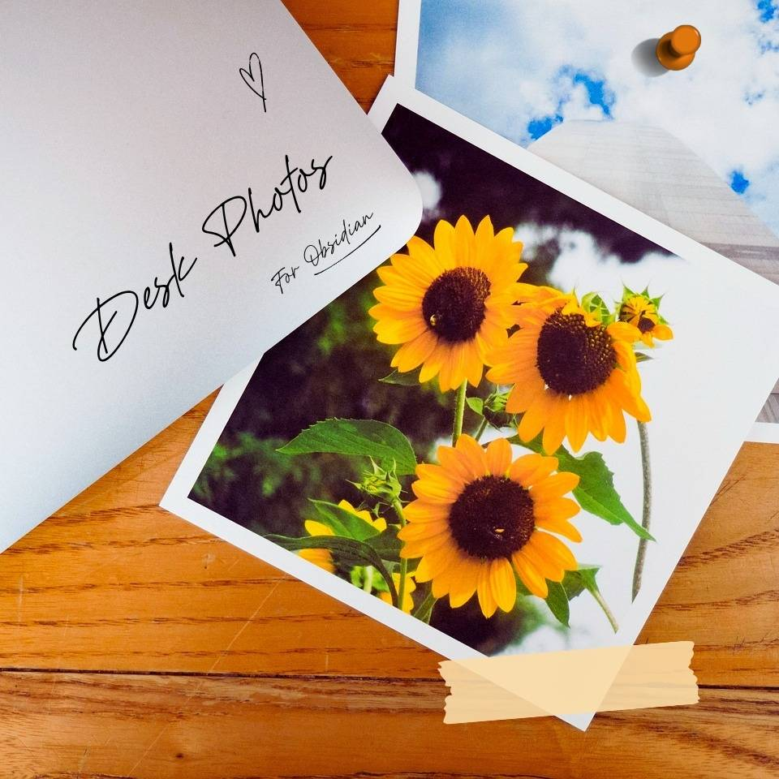
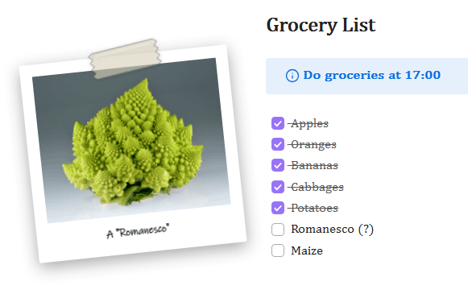

<h1 align="center">Desk Photos</h1>

	
	
	

	<a href="#gallery">Gallery</a>
	·
	<a href="#installation">Installation</a>
	·
	<a href="#usage">Usage</a>
	·
	<a href="#behavior-notes">Behavior notes</a>
	·
	<a href="#contribution">Contribution</a>
	·
	<a href="#disclaimer">Disclaimer</a>
	·
	<a href="#license">License</a>

An Obsidian plugin (for desktop only) that adds sticky and floating photos on top of the editor, fixed to the screen or to some part of a note. They are highly customizable with various effects (such as filters and sounds) and graphics (such as frames, tapes, pins, and texts) provided by the plugin. Positions are stored relative to the editor or note area and persist across sessions.

Check the gallery below to see this plugin in action!

---

## Gallery

<video src="https://github.com/user-attachments/assets/e9395ea0-8055-4870-96fb-63bd8abdbdcd" alt="Demonstration video" controls="controls"></video>

---

---

---

---

## Installation

### Inside Obsidian
1. Go to [this page](https://community.obsidian.md/plugins/desk-photos)
2. Click "Add to Obsidian"
3. Click "Install", then click "Enable"

### Manual
Create a folder named `desk-photos` inside your vault's `.obsidian/plugins` folder. Copy the `assets` folder, `main.js`, `manifest.json`, and `styles.css` from this repository into your `desk-photos` folder.

> [!NOTE]
> The folder must be named `desk-photos` to match the plugin ID. Plugin data is stored at `.obsidian/plugins/desk-photos/data.json`.

> [!NOTE]
> The interface sounds are read from `.obsidian/plugins/desk-photos/assets/` (`flip.webm` for flipping, `slide.webm` for adding, removing, and dragging). If a file is missing, the plugin downloads it once from the GitHub repository and stores it there. These are optional, however, and the plugin will still work fine without them.

Enable **Desk Photos** in Settings, under Community plugins.

---

## Usage

<b>Adding a photo</b>

- Run *Add desk photo* from the command palette, or right-click in the editor and choose *Add desk photo*.
- Pick an image from the vault or enter a direct web link.
- The photo keeps the image's proportions. Large images are scaled down so the photo stays well under half of the editor area.

<b>Basic interactions</b>

- Drag a photo with the left mouse button (unless it is locked). A slide sound plays when a drag starts, when a photo is added, and when one is removed.
- Hold left-click for one second to play the photo's sound. *Play sound* in the context menu does the same, and reads *Stop sound* while audio is playing.
- Double-click to flip the photo over in 3D. Click or scroll anywhere outside to flip it back. The flipped state is not saved.
- Right-click a photo for the full context menu.

<b>Locking</b> (<i>Lock desk photo</i>)

- *Unlocked*: the photo can be dragged and edited.
- *Lock to screen*: the photo is pinned to its spot in the editor and ignores scrolling.
- *Lock to document*: the photo is anchored to a place in the current note. It scrolls with the text and only appears while that note is visible.
- While locked, the editing options are hidden from the menu until the photo is unlocked.
- *Peek behind* (locked photos only) fades the photo to barely visible for three seconds so anything behind it can be reached. Tapes, pins, and texts hide for the duration.

<b>Image</b> (<i>Change image</i>)

- Replace the image from the vault or from a web link.
- *Crop image* re-crops the current image without changing its shape.
- *Change image shape* switches between square and circle. Square images also have a corner radius slider.
- *Edit image* holds sliders for brightness, contrast, saturation, temperature, and transparency. At 0% transparency the image stays barely visible.
- *Edit image* also offers *Set filters* with presets (No filter, Grayscale, Vintage, Sepia, Warm, and Cool) and a *Reset to default* button that restores all five sliders. Hovering over a preset previews it on the image, and the preview reverts unless the preset is clicked.

<b>Frame</b> (<i>Change frame</i>)

- Types: no frame, blank, and polaroid. Hovering over a type in the menu previews it on the photo, and the preview reverts unless the type is clicked.
- *Change frame size* adjusts the frame thickness. 50% is the default value and a reset button restores it. 0% keeps a thin visible sliver.
- *Change frame shape* switches between square and circle, with a corner radius slider for square frames. A frame that is rounder than its image grows automatically to keep the image corners covered.
- *Change frame color* opens a compact color and transparency widget. At 0% transparency the frame stays barely visible, matching the image transparency behavior.
- *Change frame texture* (blank frames only) applies an image as the frame surface.
- Polaroid frames are always rectangular.

<b>Sound</b> (<i>Change sound</i>)

- Choose no sound, an audio file from the vault, or a web link.
- The command *Stop all desk photo sounds* stops any playing audio and can be bound to a hotkey.

<b>Size and rotation</b> (<i>Change size/rotation</i>)

- Drag the edge handles to resize.
- Toggle the aspect ratio lock with the button above the photo.
- Drag the bottom handle to rotate.

<b>Layers</b> (<i>Change layers</i>)

- *Bring forward*, *Bring to front*, *Send backward*, and *Send to back* adjust a single photo.
- *Show all layers* opens a dialog where rows of photo thumbnails can be dragged to reorder the whole stack. The top row is the front layer.

<b>Decorations</b> (tapes, pins, and texts)

- Each *Add/remove* entry opens a focused mode. Double-click the photo to add an item, and single-click an item to select it.
- Selected items show corner handles for resizing and a bottom handle for rotation.
- Tapes and pins are recolored through the button above the selection.
- Tapes must touch the photo but may overhang its edges. Pins anchor at their needle point, which must stay on the photo. Items of the same kind cannot overlap each other.
- Text boxes
	- Hold the button above a selected text box to drag it. Click a selected box again to edit its text.
	- The toolbar offers bold, italic, underline, strikethrough, color and transparency, a text size field with plus and minus buttons, and a font field that accepts the name of any installed font.
	- Text size is independent of the box size. It scales with the photo but not with the frame. Setting a larger size grows the box to fit.
	- The rendered text must stay inside the photo (frame included) and cannot overlap other texts. Box edges may hang outside.
- Hidden texts live on the back of the photo (*Add/remove hidden text* while flipped) and only show while the photo is flipped.

<b>Shadows</b> (<i>Enable/disable shadows</i>)

- Toggles the drop shadow around the photo, on both its front and back.

<b>Undo and redo</b>

- All desk photo changes are tracked in a 50-step history through the commands *Undo desk photo change* and *Redo desk photo change*.
- Obsidian's built-in undo is scoped to the text editor and cannot be extended by plugins.

---

## Behavior notes

- Photo positions are stored as fractions of the editor area, so they keep their relative spot when the window or sidebars resize.
- Photos are confined to the workspace tab body and never cover the tab headers, so tab labels and buttons stay reachable.
- If an image, sound, or frame texture goes missing, the plugin highlights the affected photo and offers to replace or remove the source. The dialog waits until any open Obsidian window (such as Settings) is closed.
- Vault sources are re-verified whenever a file in the vault is added, deleted, or moved. Renamed or moved files and folders are followed automatically, and a restored file clears its pending error.
- Web sources must be direct links reachable without authentication. A blocked or broken link is treated as a missing source.
- Photos render in the main window only, not in pop-out windows.

---

## Contribution

This plugin is actively maintained. Issues and pull requests are welcome. If you encounter a problem, please open an issue in the GitHub repository and include the steps to reproduce it. If you want to change or extend the plugin, feel free to submit a pull request.

## Disclaimer

> Most of the code in this plugin was generated with Claude Fable 5. However, the entire flow and architecture of the plugin were manually designed and thoroughly tested and debugged by the author, who uses the plugin daily in their main work vault.

## License

This project is licensed under the MPL-2.0 license.

